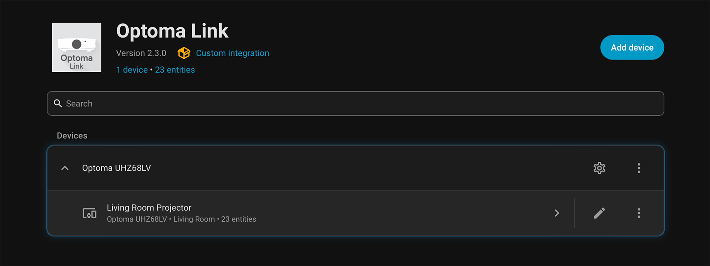
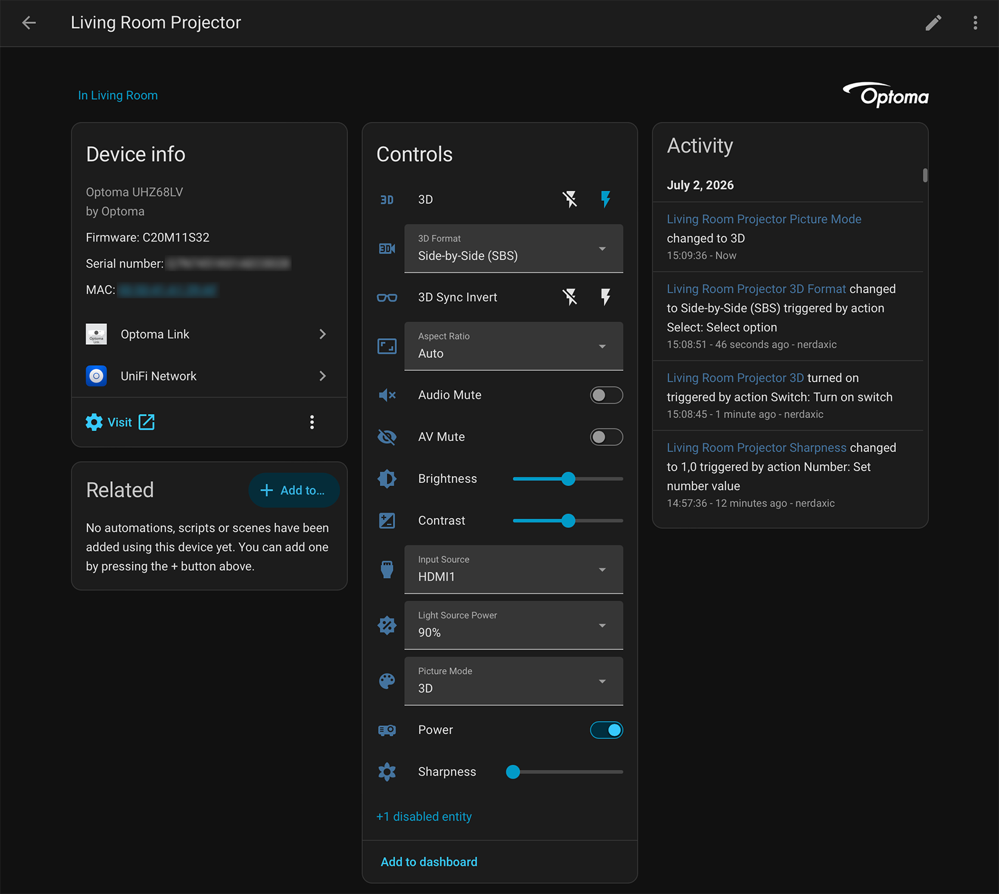

# Optoma Link

Control **Optoma projectors** from [Home Assistant](https://www.home-assistant.io/) over their RS232 ASCII protocol, either across the network (the projector's RJ-45 port, called **"RS232 by Telnet"** in Optoma's menus) or through a **direct RS232 serial cable** plugged into the machine running Home Assistant.

> **Status: beta.** The bundled UHZ68LV profile is verified against real hardware and has been through extended stability testing. The other profiles are transcribed from Optoma's documentation and have not yet been confirmed on a physical unit. Please [open an issue](https://github.com/nerdaxic/optoma_link/issues) if something misbehaves.

*The entities Optoma Link exposes, as of version 2.3.0.*

## Features

- Connect over **LAN** ("RS232 by Telnet") or a **direct serial cable**, with the same command set either way.
- **Automatic model detection** during setup, with a dropdown to confirm or override.
- Optional **test pattern** step during setup, so you can visually confirm you're talking to the right unit.
- Entities generated from the active profile: Power, AV/Audio Mute, Input Source, Picture Mode, Aspect Ratio, Brightness, Contrast, Sharpness, 3D controls, Light Source Power, Lamp/Light Source Hours, Temperature, Firmware Version, Serial Number, Resync, and more. The exact set depends on the model.
- A live **Status** sensor (Off, Warming up, On, Cooling down, Error) driven by the projector's own status pushes, so power transitions and faults (over-temperature, fan lock, and so on) show up immediately instead of at the next poll.
- **Polls only what you use:** disabled entities are never queried, device details (firmware, MAC, serial) are read once at startup, and polling automatically relaxes while the projector is off and snaps back the moment it wakes.
- Adjustable **poll interval**, and an **RS232 password** field for units with serial security enabled.
- Two services: `optoma_link.send_command` (raw passthrough) and `optoma_link.set_test_pattern`.

## What you can do with it

Optoma Link exposes the projector as first-class Home Assistant entities, so it can join scenes, scripts, and automations like any other device. A few examples:

- **Whole-room "cinema" control.** Power the projector on and off alongside the AV receiver, screen, and media player from a single script or dashboard button.
- **React to the projector turning on.** Close the blinds and dim the lights when the **Status** sensor moves to *Warming up* / *On*. This transition is *pushed* by the projector, so the automation fires promptly rather than waiting for the next poll.
- **Boost the light source for 3D.** When you switch to 3D **from Home Assistant**, set **Light Source Power** to 100% to make up for the dimming from active-shutter glasses. (Trigger it from Home Assistant, not the remote: the projector doesn't report picture-mode changes back, so Home Assistant only knows the mode changed when *it* made the change.)
- **Switch inputs programmatically.** Select HDMI 1/2/3 from an automation — e.g. flip to a console's input when it wakes, or to a signage source overnight.
- **Freeze the image.** Hold the current frame with the **Image Freeze** switch, handy for pausing on a slide. Note the projector *clears* the freeze when the input changes, so it can't be used to mask a source switch (you can't freeze HDMI 1, change to HDMI 2, then unfreeze).

## Supported projectors

| Model profile | `model_id` | Verified on hardware |
|---|---|---|
| Optoma UHZ68LV | `uhz68lv` | ✅ Yes |
| Optoma W501 / EW501 / EH501 / X501 | `w501` | ⚠️ From documentation only |
| Optoma ZU650 / ZU650T / ZU650T+ | `zu650` | ⚠️ From documentation only |

The integration itself is model-agnostic: every entity and command comes from a small JSON **profile** in [`projectors/`](https://github.com/nerdaxic/optoma_link/tree/main/custom_components/optoma_link/projectors). Because the protocol is shared across Optoma's range, the integration will often work on models not listed here once a matching profile is added — see *Adding a projector profile* below. No Python required.

## Requirements

- A recent Home Assistant release (the integration uses the modern config-flow and `DataUpdateCoordinator` APIs).
- The projector reachable on your network (LAN) or wired to the host (serial), with RS232 control enabled in its on-screen menu.
- For **serial** connections, `pyserial-asyncio-fast` and `pyserial` are installed by Home Assistant automatically.

## Installation

### One-click (recommended)

Needs [My Home Assistant](https://www.home-assistant.io/integrations/my/) linked to your browser, and HACS already installed — if a badge doesn't take you anywhere, use **HACS (manual steps)** below instead.

Click, then **Download** in HACS and **Restart Home Assistant**. Once it's back up, click the second badge to jump straight into setup (it won't work until after the restart, since Home Assistant needs to have loaded the integration first):

### HACS (manual steps)

1. In HACS, open the **⋮** menu (top right) → **Custom repositories**.
2. Add repository `https://github.com/nerdaxic/optoma_link` with type **Integration**.
3. Find **Optoma Link** in HACS and choose **Download**.
4. **Restart Home Assistant.**

### Manual

1. Download this repository (**Code → Download ZIP**, or `git clone`).
2. Copy the `custom_components/optoma_link` folder into your Home Assistant `config/custom_components/` directory (create `custom_components/` if it doesn't exist).
3. **Restart Home Assistant.**

After restarting, go to **Settings → Devices & Services → Add Integration** and search for **Optoma Link**.

## Configuration

Setup runs entirely in the UI:

1. **Choose a connection:** network ("RS232 by Telnet") or direct serial.
2. **Enter connection details:**
   - *LAN:* host/IP, port (default `23`), 2-digit projector ID (default `00`), and an optional RS232 password. If the projector can't be reached, you'll get a hint pointing at **Network → LAN / Control** in its on-screen menu.
   - *Serial:* pick (or type) the serial port, baud rate (default `9600`, the Optoma standard), projector ID, and optional password.
3. **Confirm the model:** the integration tries to auto-detect it. Confirm or pick from the dropdown and give the device a name (a short name like "Living Room Projector" reads best in entity IDs and voice assistants).
4. **Test pattern** *(if the model supports it)*: toggle the projector's built-in test grid on and off to confirm you're connected to the right unit, then finish.

The **poll interval** can be changed later from the integration's options (default 30 seconds, range 5 to 300 seconds).

## How updates work (local polling)

Optoma Link talks to the projector over RS232, a question-and-answer protocol. Home Assistant polls the projector on an interval (default 30 seconds, configurable), so a change made on the projector can take up to that long to show up. The exceptions are power transitions and faults, which the projector *pushes* on its own and therefore appear immediately.

Polling is deliberately economical:

- **Only enabled entities are polled.** Disabling an entity (Settings → Devices → the entity → gear icon → *Enabled* off) removes its query from the cycle entirely. Fewer enabled entities also means a shorter poll cycle, so the values you *do* care about refresh closer to the configured interval.
- **Device details are read once.** Firmware version, MAC address, and serial number are fetched at startup, not on the timer (retried only until the projector answers with real values).
- **The interval adapts to power state.** While the projector is off, polling relaxes to at least 60 seconds — nothing it reports can change in standby. The projector's own power-on push (or a power command from Home Assistant) restores the configured interval immediately.

Some controls are **write-only**: the projector accepts a value but offers no command to read it back (for example 3D, 3D Format, and Light Source Power). For these, Home Assistant can only show the last value it sent, which means:

- After setup, before you have touched them, they read as **Unknown**. That is expected, set them once from Home Assistant and they will start showing a value.
- If you change them with the projector's own remote, Home Assistant will not see it and its value goes stale until you set it again from Home Assistant.

Everything with a read-back (power, mutes, input source, picture mode, brightness, contrast, lamp hours, temperature, and so on) is polled and stays in sync on its own.

## Services

### `optoma_link.send_command`

Send a raw RS232 command and get the projector's reply back. Use this for anything not exposed as an entity; consult your projector's Optoma RS232 command table.

| Field | Required | Example | Description |
|---|---|---|---|
| `code` | yes | `"20"` | Numeric command code from Optoma's RS232 table. |
| `value` | no | `"21"` | Value sent after the code (omit for value-less commands). |
| `entry_id` | no | | Target a specific projector if you have more than one. |

### `optoma_link.set_test_pattern`

Show or hide the projector's built-in test pattern (if its profile defines one).

| Field | Required | Example | Description |
|---|---|---|---|
| `enabled` | yes | `true` | `true` shows the pattern, `false` hides it. |
| `entry_id` | no | | Target a specific projector if you have more than one. |

## Known issues

- **UHZ68LV firmware bug: the IP Address query can crash the projector's software.** On UHZ68LV firmware DDP C22 / MCU M12 / Scalar S32, the RS232 query for the projector's own IP address (`~XX87 3`) intermittently (~1 in 20 calls) crashes the projector's internal `ProjectorService` — the projector briefly shows a *"ProjectorService: Central service has been disconnected"* toast and recovers within a second or two. This is a firmware defect, not specific to this integration: any RS232 controller issuing that query can trigger it (reported to Optoma; see [issue #1](https://github.com/nerdaxic/optoma_link/issues/1) for the full investigation). The integration's **IP Address sensor is disabled by default**, and disabled entities are never polled, so a default installation never sends this query. If you enable the IP Address sensor and start seeing the toast, **disable the sensor again** — that stops the query and the crashes with it.
- **Setup fails while the projector is playing 3D.** The test-pattern step (and some other commands) are refused while the projector is displaying 3D content. Turn off 3D on the projector before running setup, then re-enable it afterwards.
- **Some picture modes are content-specific.** The projector groups picture modes into SDR, HDR, Dolby Vision, and 3D "universes" and refuses a mode that does not match what is playing (for example, selecting a Dolby Vision mode during HDR10 content). Home Assistant surfaces this as a mode-conflict message.
- **Write-only controls read Unknown until set.** See [How updates work](#how-updates-work-local-polling) above.

## Adding a projector profile

A profile is a JSON file in [`projectors/`](https://github.com/nerdaxic/optoma_link/tree/main/custom_components/optoma_link/projectors). It maps a model's logical entities to RS232 command codes. The integration sends commands as `~{projector_id}{code} {value}` followed by a carriage return, and expects `P` (pass) or `F` (fail) for writes, or `Ok{value}` for reads.

### Top-level keys

| Key | Required | Notes |
|---|---|---|
| `schema_version` | yes | Currently `1`. |
| `model_id` | yes | Unique slug, e.g. `"uhz68lv"`. Used as the profile key. |
| `display_name` | yes | Human-readable, e.g. `"Optoma UHZ68LV"`. |
| `manufacturer` | no | Defaults to `"Optoma"`. |
| `aliases` | no | Other names the model reports as, used for auto-detection. |
| `verified` | no | `true` once confirmed on real hardware. |
| `source` | no | Where the command codes came from (doc title/revision). |
| `detect` | no | `{ "read_code", "read_sub", "value_type", "index_map" }`. `index_map` maps a numeric model reply (e.g. `"1"`) to a model name for older firmwares. |
| `capabilities` | no | e.g. `{ "three_d": true, "wol": true }`. |
| `test_pattern` | no | `{ "write_code", "on", "off" }`. |
| `switches` / `selects` / `numbers` / `binary_sensors` / `sensors` / `buttons` | no | Entity lists (see below). |

### Entity specs

Every entity has a `key` (unique within the profile), a `name`, and an optional `icon` (`mdi:` name). A `read` value is a `[code, sub_value]` pair, or `null` for write-only controls (which become assumed-state entities reflecting the last value sent).

- **switch**: `on` and `off` as `[code, value]` pairs, plus optional `read`.
- **select**: `write_code`, `options` (`{ label: value }` sent on write), optional `read` and `read_options` (`{ raw_value: label }` for display).
- **number**: `write_code`, `min`, `max`, optional `step` (default 1), optional `unit`, optional `read`.
- **binary_sensor**: `read` (always read-only).
- **sensor**: `read`, optional `value_type` (`"str"`, `"int"`, or `"float"`), `unit`, `device_class` (`"temperature"`), `state_class` (`"measurement"` or `"total_increasing"`), `entity_category` (`"diagnostic"`).
- **button**: `command` as `[code, value]`, optional `entity_category`.

The three bundled profiles are worth reading as worked examples. Pull requests that add or correct profiles are very welcome — especially marking one `verified` after testing on real hardware.

## Versioning

This project follows [Semantic Versioning](https://semver.org/). The version in `manifest.json` always matches the latest [GitHub release](https://github.com/nerdaxic/optoma_link/releases), which HACS uses to offer updates.

## Disclaimer

This is an unofficial, community-built integration. It is not affiliated with, endorsed by, or supported by Optoma. "Optoma" and product model names are trademarks of their respective owners and are used here only to describe compatibility.

## License

Copyright © 2026 nerdaxic.

Optoma Link is licensed under the **GNU Affero General Public License v3.0 (AGPL-3.0)**. See [LICENSE](https://github.com/nerdaxic/optoma_link/blob/main/LICENSE) for the full text. You are free to use, study, modify, and share it, including commercially, provided that any distributed or network-deployed derivative work is also released under the AGPL-3.0 with complete corresponding source, and that attribution is preserved.

### Commercial / proprietary licensing

If you want to incorporate this code into a closed-source or commercial product and the AGPL-3.0's copyleft terms don't work for you, a separate commercial license is available. Please [open an issue](https://github.com/nerdaxic/optoma_link/issues) or get in touch to arrange terms.

## Contributing

Issues and pull requests are welcome: bug reports, new or corrected projector profiles, and hardware verification of the unverified profiles especially. By contributing you agree your contribution is licensed under the AGPL-3.0.
